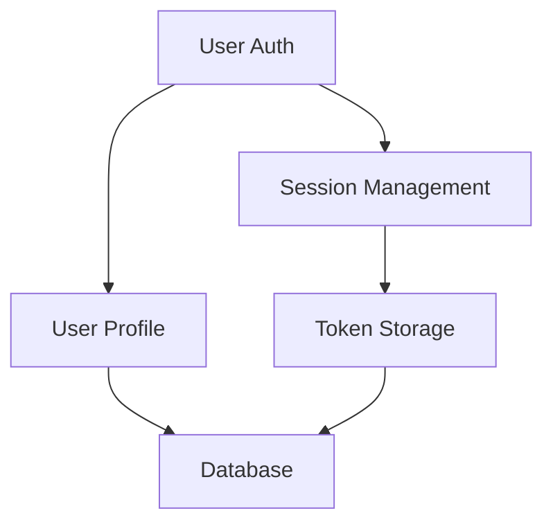

# Sequential-Thinking MCP Adapter

Adapter for integrating Sequential-Thinking MCP server with the requirements builder.

## Overview

Sequential-Thinking provides structured problem decomposition and systematic analysis for complex requirements. It breaks down requirements into analyzable components, identifies dependencies, and generates targeted questions.

## Core Functions

### analyzeRequirement(description)
Decomposes a requirement into structured components using thought streams.

**Process:**
1. Create thought stream for the requirement
2. Break down into logical components
3. Identify dependencies between components
4. Assess risks and complexity
5. Generate knowledge gaps for questioning

**Example Usage:**
```javascript
const analysis = await analyzeRequirement("implement user authentication with SSO");
// Returns:
{
  components: [
    { id: "auth-core", name: "Core Authentication", complexity: 0.6 },
    { id: "sso-integration", name: "SSO Integration", complexity: 0.8 },
    { id: "session-mgmt", name: "Session Management", complexity: 0.4 }
  ],
  dependencies: {
    "sso-integration": ["auth-core"],
    "session-mgmt": ["auth-core"]
  },
  risks: [
    { id: "security", severity: "high", description: "Token storage security" },
    { id: "compatibility", severity: "medium", description: "SSO provider compatibility" }
  ],
  confidence: 0.85
}
```

### generateSmartQuestions(analysis)
Creates targeted questions based on identified knowledge gaps.

**Question Generation Strategy:**
```yaml
priority_factors:
  critical_path: 0.4
  risk_mitigation: 0.3
  user_impact: 0.2
  technical_complexity: 0.1

question_types:
  clarification: "Resolve ambiguity in requirements"
  decision: "Critical technical or business decisions"
  constraint: "Identify limitations and boundaries"
  preference: "User or stakeholder preferences"
```

**Example Output:**
```javascript
[
  {
    id: "q1",
    text: "Should the SSO integration support multiple providers simultaneously?",
    type: "decision",
    impact: "high",
    dependencies: ["sso-integration"],
    default: "no",
    rationale: "Most systems start with single provider"
  },
  {
    id: "q2",
    text: "Will users need to remain logged in across browser sessions?",
    type: "constraint",
    impact: "medium",
    dependencies: ["session-mgmt"],
    default: "yes",
    rationale: "Standard user expectation"
  }
]
```

### identifyRisks(requirement)
Analyzes potential risks and suggests mitigation strategies.

**Risk Categories:**
- **Technical**: Implementation complexity, integration challenges
- **Security**: Vulnerabilities, data protection concerns
- **Performance**: Scalability issues, bottlenecks
- **Business**: Cost overruns, timeline risks
- **User Experience**: Usability problems, adoption barriers

**Risk Assessment Matrix:**
```yaml
severity_levels:
  critical: "Project blocker, immediate attention"
  high: "Significant impact, mitigation required"
  medium: "Notable concern, monitor closely"
  low: "Minor issue, document for awareness"

probability_scale:
  very_likely: 0.8-1.0
  likely: 0.6-0.8
  possible: 0.4-0.6
  unlikely: 0.2-0.4
  rare: 0.0-0.2
```

### mapDependencies(components)
Creates a dependency graph for requirement components.

**Dependency Types:**
- **Hard**: Component A requires Component B to function
- **Soft**: Component A works better with Component B
- **Optional**: Component A can utilize Component B if available
- **Mutual**: Components A and B depend on each other

**Visualization Format:**


## MCP Integration

### Command Mappings
```yaml
mcp_commands:
  create_stream: mcp__sequential_thinking__create_thought_stream
  add_thought: mcp__sequential_thinking__add_thought
  get_thoughts: mcp__sequential_thinking__get_thoughts
  update_thought: mcp__sequential_thinking__update_thought
  
parameters:
  stream_id: "requirement-{timestamp}"
  thought_types:
    - ANALYSIS
    - QUESTION
    - RISK
    - DEPENDENCY
    - RECOMMENDATION
```

### Thought Stream Structure
```javascript
{
  stream_id: "requirement-2024-01-27-1430",
  thoughts: [
    {
      id: "t1",
      type: "ANALYSIS",
      content: "Breaking down authentication requirement",
      confidence: 0.9,
      tools_needed: ["database", "api", "frontend"],
      next_steps: ["identify auth methods", "assess complexity"]
    },
    {
      id: "t2",
      type: "RISK",
      content: "Security vulnerability in token storage",
      severity: "high",
      mitigation: "Use secure storage with encryption"
    }
  ]
}
```

## Usage Patterns

### Pattern 1: Initial Requirement Analysis
```javascript
// Phase 1: Create thought stream
const streamId = await createThoughtStream(requirement.description);

// Phase 2: Decompose requirement
await addThought(streamId, {
  type: "ANALYSIS",
  content: "Decomposing into components..."
});

// Phase 3: Identify dependencies
const dependencies = await analyzeDependencies(streamId);

// Phase 4: Generate questions
const questions = await generateQuestions(streamId);
```

### Pattern 2: Progressive Refinement
```javascript
// After each answer, refine analysis
for (const answer of userAnswers) {
  await addThought(streamId, {
    type: "REFINEMENT",
    content: `User answered: ${answer}`,
    impact: assessImpact(answer)
  });
  
  // Adjust remaining questions
  questions = await refineQuestions(streamId, answer);
}
```

### Pattern 3: Risk-Driven Analysis
```javascript
// Focus on high-risk areas
const risks = await identifyRisks(requirement);
const criticalRisks = risks.filter(r => r.severity === "critical");

for (const risk of criticalRisks) {
  // Generate mitigation-focused questions
  const mitigationQuestions = await generateMitigationQuestions(risk);
  questions.push(...mitigationQuestions);
}
```

## Output Integration

### Into metadata.json
```json
{
  "mcp_analysis": {
    "sequential_thinking": {
      "timestamp": "2024-01-27T14:30:00Z",
      "stream_id": "requirement-2024-01-27-1430",
      "decomposition": [...],
      "dependencies": {...},
      "risks": [...],
      "confidence": 0.85,
      "thought_count": 12
    }
  }
}
```

### Into 03-context-findings.md
```markdown
## Sequential-Thinking Analysis

### Component Breakdown
1. **Authentication Core** (Complexity: 0.6)
   - User credential management
   - Password hashing and validation
   - Session initialization

2. **SSO Integration** (Complexity: 0.8)
   - Provider configuration
   - Token exchange
   - Profile mapping

### Dependency Map
- SSO Integration → Authentication Core (hard dependency)
- Session Management → Authentication Core (hard dependency)

### Risk Assessment
- **HIGH**: Token storage security requires encryption
- **MEDIUM**: SSO provider compatibility needs testing
- **LOW**: Session timeout configuration is straightforward
```

## Performance Optimization

### Caching Strategy
- Cache decompositions for similar requirements (TTL: 30 min)
- Store question templates for reuse
- Remember risk patterns across sessions

### Parallel Processing
- Run risk assessment concurrently with decomposition
- Generate questions while analyzing dependencies
- Batch thought additions for efficiency

## Error Handling

### Common Errors
1. **Thought stream creation failed**: Fallback to native analysis
2. **Timeout on decomposition**: Use partial results
3. **Invalid thought type**: Log and continue with valid thoughts

### Recovery Strategies
```javascript
try {
  const analysis = await sequentialAnalysis(requirement);
  return analysis;
} catch (error) {
  console.log("Sequential-Thinking unavailable, using fallback");
  return await nativeAnalysis(requirement);
}
```

## Success Metrics

### Quality Indicators
- Decomposition completeness: > 90%
- Risk identification accuracy: > 85%
- Question relevance score: > 4.0/5.0
- Dependency mapping coverage: > 95%

### Performance Targets
- Initial analysis: < 3 seconds
- Question generation: < 1 second
- Full decomposition: < 5 seconds
- Risk assessment: < 2 seconds

## Future Enhancements

1. **Learning Integration**: Improve decomposition based on historical patterns
2. **Multi-Stream Analysis**: Compare multiple approaches simultaneously
3. **Confidence Calibration**: Adjust confidence based on outcomes
4. **Pattern Library**: Build reusable decomposition templates
5. **Collaborative Thinking**: Combine multiple thought streams from different stakeholders